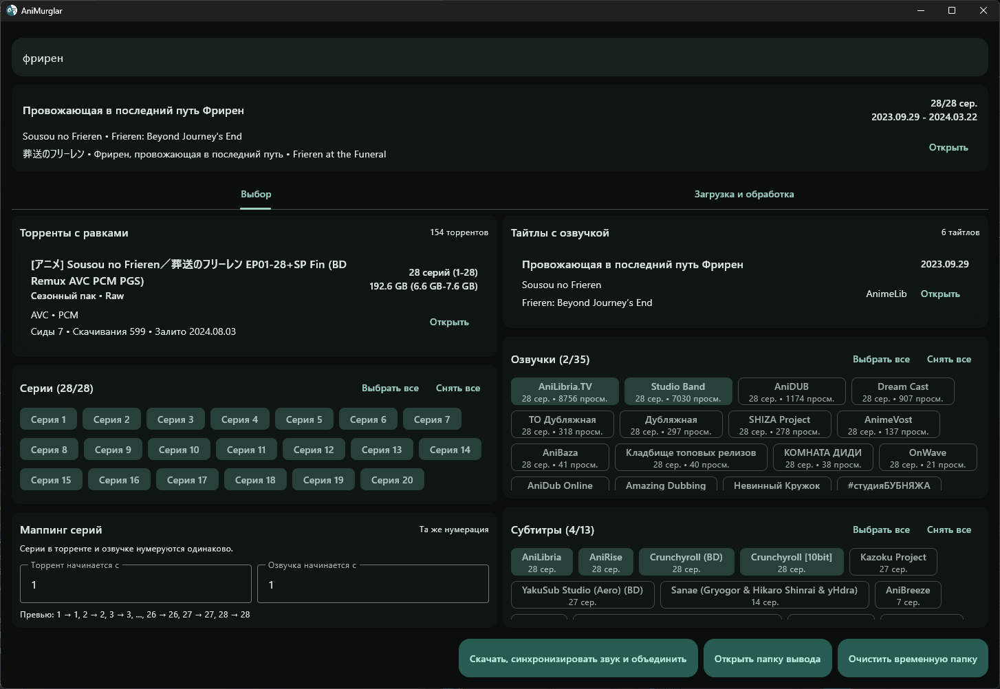

# AniMurglar

Приложение для получения аниме с качественным видео, русскими озвучками и субтитрами:
- По названию аниме ищет его на Шикимори
- Ищет и качает с Nyaa.si выбранную раздачу с качественным видео
- Ищет и качает с Kodik выбранные озвучки
- Ищет и качает с Anime365 выбранные русские субтитры
- Синхронизирует звук
- Создает из полных субтитров дополнительно версии только с надписями/песнями/etc.
- Объединяет видео, оригинальный звук, озвучки и субтитры в итоговый MKV

> Для работы требуется установленный и запущенный **qbittorrent** с включенным в настройках веб-интерфейсом
> и либо стандартным логином-паролем (_admin/adminadmin_), либо включенным пропуском авторизации для localhost клиентов.

> Указать кастомную рабочую папку можно с помощью аргумента при запуске: `AniMurglar.exe <путь к папке>`

## Нюансы
- Временная и итоговая папки по умолчанию находятся в папке аппы, так что запускать ее лучше на SSD с хотя бы х2.5 свободного места от размера торрентов и озвучек
- Т.к. все промежуточные файлы сохраняются (чтобы в случае ошибки/краша продолжить с того этапа, где остановилось), то после окончания процесса, если все ок, стоит нажать кнопку "Очистить временную папку"
- В /temp/\<title>/processing/dubs/\<team>/analyze лежит план синхронизации + картиночки, по которым можно визуально оценить, где что пошло не так при синхронизации звука
- Если соберетесь репортить какую-то проблему, то сразу кидайте название тайтла/сезон/ссылки на раздачи/озвучки/etc и логи из /logs в папке аппы.
